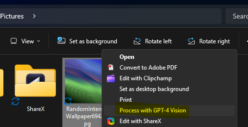

# GPT-4 Image File Renamer

This project provides a tool to rename image files based on descriptions generated by the GPT-4 Vision API. It's designed to be easy to use on any Windows machine with Python installed.

## Screenshots

### Windows Context Menu - Process with AI



### Processing Images Window with GPT-4 Vision Progress Bar


### Renamed Image Example


## Installation

Before you begin, ensure you have Python installed on your system. Python 3.6 or higher is required.
To clone the repository, use the following command:

```bash
git clone https://github.com/your-username/gpt-4-image-file-renamer.git
cd gpt-4-image-file-renamer
```


1. Clone the repository or download the ZIP file and extract it to a local directory.
2. Navigate to the project directory in your command prompt or terminal.
3. Install the required dependencies by running:

```bash
pip install -r requirements.txt
```

- Set the `OPENAI_API_KEY` environment variable with your OpenAI API key. This can be done by running the following command in the command prompt (replace `your_api_key` with your actual API key):

```bash
setx OPENAI_API_KEY "your_api_key"
```

Note: You will need to restart the command prompt for the changes to take effect.

## Usage

To use the GPT-4 Image File Renamer, simply run the `run.bat` file from the command prompt. This will add a new entry to the Windows context menu, allowing you to right-click on image files and process them with GPT-4 Vision.

Once the context menu entry is added, you can right-click on any image file in Windows Explorer and select "Process with GPT-4 Vision". The GPT-4 Vision API will analyze the image and suggest a new, descriptive file name based on its content. Confirm the rename action, and the file will be renamed automatically.

## How It Works

The `image_processor.py` script takes image files as input, encodes them in base64, and sends them to the GPT-4 Vision API. The API generates a Windows-compatible file name based on the content of the image. The script then renames the image files accordingly.
The script uses the OpenAI API to analyze the content of the images and suggest new file names that are descriptive of the image content. It then applies these new names to the image files, effectively renaming them.

## Contributing

Contributions are welcome! If you have a bug report, feature request, or a pull request, please feel free to contribute to the project.
To contribute, you can fork the repository, make your changes, and then submit a pull request. For bug reports and feature requests, please open an issue on the GitHub repository with a detailed description.

## License

This project is licensed under the MIT License - see the LICENSE file for details.