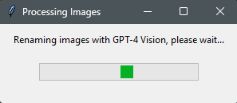

# GPT-4 Image File Renamer

This project provides a tool to rename image files based on descriptions generated by the GPT-4 Vision API. It's designed to be easy to use on any Windows machine with Python installed.

## Screenshots

### Windows Context Menu - Process with AI


### Processing Images Window with GPT-4 Vision Progress Bar



## Installation

Before you begin, ensure you have Python installed on your system. Python 3.6 or higher is required.

1. Clone the repository or download the ZIP file and extract it to a local directory.
2. Navigate to the project directory in your command prompt or terminal.
3. Install the required dependencies by running:

```bash
pip install -r requirements.txt
```

- Set the `OPENAI_API_KEY` environment variable with your OpenAI API key. This can be done by running the following command in the command prompt (replace `your_api_key` with your actual API key):

```bash
setx OPENAI_API_KEY "your_api_key"
```

Note: You will need to restart the command prompt for the changes to take effect.

## Usage

To use the GPT-4 Image File Renamer, you can simply run the `run.bat` file from the command prompt. This will start the process of renaming your image files.

Optionally, you can add a context menu entry to process images with GPT-4 Vision by running `run.bat` and choosing 'Y' when prompted.

## How It Works

The `image_processor.py` script takes image files as input, encodes them in base64, and sends them to the GPT-4 Vision API. The API generates a Windows-compatible file name based on the content of the image. The script then renames the image files accordingly.

## Contributing

Contributions are welcome! If you have a bug report, feature request, or a pull request, please feel free to contribute to the project.

## License

This project is licensed under the MIT License - see the LICENSE file for details.